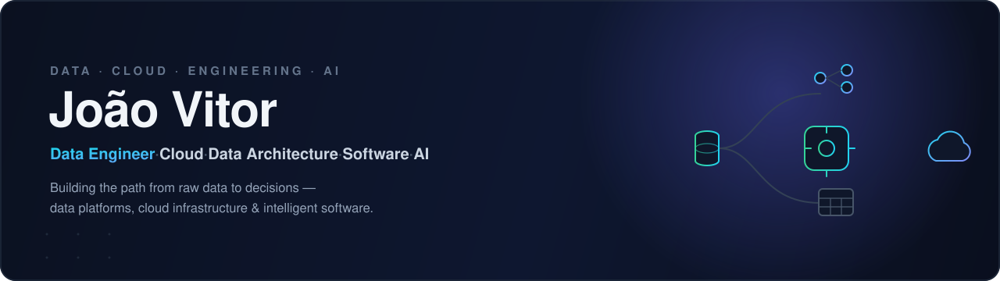
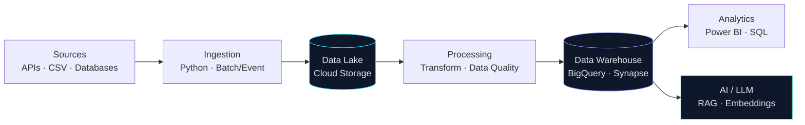
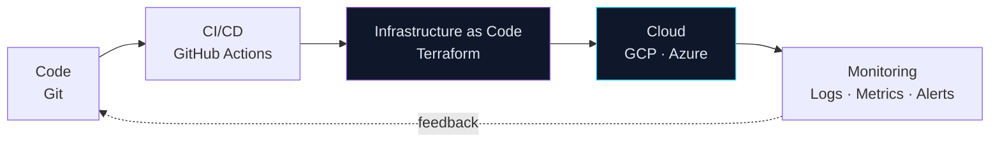

<!--
  Profile README — João Vitor (@Vitor5236)
  Data Engineering · Cloud · Data Architecture · Software · AI
-->

  

  
  
  

---

## About

I started in the data trenches — writing **SQL and PL/SQL on Oracle**, building **BI dashboards**, wiring up ETL routines and automating business processes. That work taught me something most tooling hype skips: a data solution is only worth as much as it is **reliable, reproducible and understood by the business**.

Today I'm building upward from that foundation into **Data Engineering, Cloud (GCP & Azure), Data Architecture and AI/LLM applications** — designing systems that go from a raw source to a decision without breaking in production.

I like the full arc of a problem: **understand the business need → design the architecture → build the solution → automate its infrastructure → ship it with CI/CD → keep it observable.** Not just scripts. Systems.

---

## What I Build

<table>
  <tr>
    <td width="33%" valign="top">
      <b>🛢️ Data Platforms</b> 
      Ingestion → lake → warehouse, with data quality baked in.
    </td>
    <td width="33%" valign="top">
      <b>🔀 Data Pipelines</b> 
      Batch & event-driven ELT — idempotent, tested, monitored.
    </td>
    <td width="33%" valign="top">
      <b>☁️ Cloud Architecture</b> 
      GCP & Azure designs provisioned as code with Terraform.
    </td>
  </tr>
  <tr>
    <td valign="top">
      <b>🔌 APIs & Integrations</b> 
      REST services, system integration, public-data ingestion.
    </td>
    <td valign="top">
      <b>🤖 AI / LLM Applications</b> 
      RAG, embeddings, vector search — with evaluation & observability.
    </td>
    <td valign="top">
      <b>⚙️ Automation & DevOps</b> 
      CI/CD, Infrastructure as Code, reproducible environments.
    </td>
  </tr>
</table>

---

## Tech Stack

> Curated, not a wall of logos — these are the tools I actually design and build with across the projects below.

**Languages**

  
  
  
  
  

**Data Engineering & Analytics**

  
  
  
  

**Cloud**

  
  
  
  

**Databases**

  
  
  

**DevOps & IaC**

  
  
  

**AI / LLM**

  
  
  
  

---

## Featured Projects

> A portfolio designed to tell one story — **Data → Engineering → Cloud → Architecture → Software → AI**.
> These are **personal / portfolio projects** built to demonstrate capability (see the note at the bottom). Cases are shipping across this portfolio right now — each becomes a full case study with problem, architecture, trade-offs and results.

| # | Project | What it demonstrates | Stack | Status |
|---|---------|----------------------|-------|--------|
| 1 | **Data Platform** | End-to-end ingestion → lake → warehouse with data quality, tests & IaC | Python · SQL · dbt · Docker · Terraform · CI/CD | 🟡 Building |
| 2 | **Cloud Data Engineering (GCP)** | Cloud-native pipeline on GCP with least-privilege IAM | Cloud Storage · BigQuery · Cloud Run · Terraform | ⚪ Planned |
| 3 | **Azure Data Platform** | Multi-cloud proof — equivalent solution on Azure | Blob Storage · Functions · Synapse · Entra ID | ⚪ Planned |
| 4 | **API + Data Pipeline** | Public API → processing → own REST API → analytics | Python · FastAPI · PostgreSQL · Docker | ⚪ Planned |
| 5 | **Data + AI / RAG** | Retrieval-augmented LLM app with evaluation & observability | Embeddings · Vector DB · LLM · FastAPI | ⚪ Planned |
| 6 | **Software + Data** | Full-stack, data-driven product with auth & CI/CD | React · TypeScript · Supabase · Cloud | ⚪ Planned |

Legend: 🟢 Live · 🟡 Building · ⚪ Planned — this table updates as each case ships.

---

## Architecture I Work With

**Data flow — from source to intelligence**

**Infrastructure & delivery — how it ships**

---

## Engineering Principles

| Principle | What it means in my work |
|-----------|--------------------------|
| **Automation first** | If I do it twice by hand, it becomes a script or a pipeline. |
| **Infrastructure as Code** | No click-ops. Environments are reproducible from a repo. |
| **Reproducibility** | Same input, same result — pinned deps, containers, seeds. |
| **Scalability** | Design for the next 10× of data, not just today's volume. |
| **Data Quality** | Tests and contracts on data, not only on code. |
| **Security** | Least privilege, no secrets in git, identity-aware access. |
| **Observability** | Logs, metrics and alerts are part of the deliverable. |
| **Clean Architecture** | Clear boundaries; business logic independent of frameworks. |

---

## Current Focus

  
  
  
  
  

Designing cloud-native data platforms, sharpening multi-cloud architecture, and building AI applications that stand on solid data engineering — not just an API call.

---

<table>
  <tr>
    <td>
      
    </td>
    <td>
      
    </td>
  </tr>
</table>

ℹ️ Repositories here are <b>personal / portfolio projects</b> built to demonstrate technical capability. They are clearly separated from professional experience, which lives on my <a href="https://www.linkedin.com/in/jo%C3%A3o-vitor-dourado07">LinkedIn</a>.
